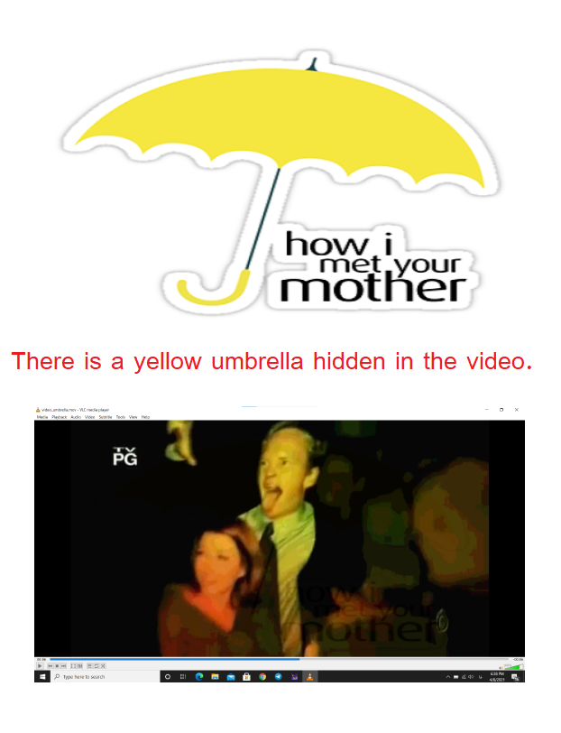
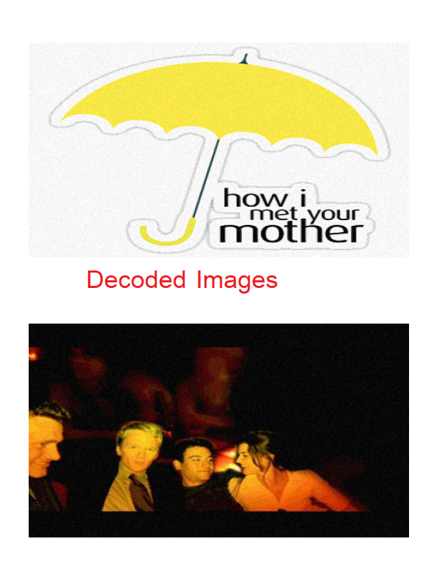

# How I met your mother title sequence steganography 

In this project, A specific image is hidden in multimedia content(video).

The title sequence is taken from the television series "How I Met Your Mother."

In the title sequence video, I hid two different images: one is a yellow umbrella with written text, while the other is an image that appeared in that title sequence.

Encryption and decryption of steganography were implemented.

Hidden images will have decode at the end of their names.

## Language
The project is written in python.

## Documentation
The document is written in Persian. (will be translated soon!!)

[View the document for more information ](MobinaKashanian-96522321.pdf) 

## Images
</img> 
</img> 
</img> 

## Contributing
Pull requests are welcome. For major changes, please open an issue first to discuss what you would like to change.

Please make sure to update tests as appropriate.

## License
[MIT](https://choosealicense.com/licenses/mit/)
